# 佳明运动数据同步与采集工具

<a style="display:inline-block;background-color:#FC5200;color:#fff;padding:5px 10px 5px 30px;font-size:11px;font-family:Helvetica, Arial, sans-serif;white-space:nowrap;text-decoration:none;background-repeat:no-repeat;background-position:10px center;border-radius:3px;background-image:url('https://badges.strava.com/logo-strava-echelon.png')" href='https://strava.com/athletes/84396978' target="_clean">
  关注作者Strava
  
</a>

**自动 安全 省心**

此工具实现了佳明运动活动数据（生理数据如睡眠，身体电量等除外）的一次性迁移与日常运动数据与国际区的同步，实现同步运动数据到到Strava [Strava全球热图](https://www.strava.com/heatmap) 。
额外还实现了RQ数据采集记录跑力的长期趋势。

## 功能

### 迁移数据

- 支持佳明账号中已有的运动数据从中国区一次性迁移到国际区
- 支持佳明账号中已有的运动数据从国际区一次性迁移到中国区

### 同步数据

- 约每20分钟左右检查当前中国区账号中是否有新的运动数据，如有则自动下载上传到国际区，并同步到Strava。
- 如果您常用的是国际区，想要在微信运动中显示 【Garmin手表 骑行xx分钟】（[微信运动效果](./assets/wx_sport.jpg)），此工具可以实现自动反向同步中国区，因为使用人数很少，功能没有放出来，有需要可以单独联系我。

### 采集数据

- 采集RQ统计数据到GoogleSheets，记录跑力的长期趋势

## 说明

#### 账号安全：

账号及密码保存在自己的 `github secrets` 中，不会泄露，运行代码均 **开放源码**，欢迎提交`PR`。

#### 进群讨论

为方便讨论，请加我绿色软件：`nononopass` （[二维码扫码](./assets/wechat_qr.png)） 我拉你进群。

#### 支持作者

如果帮助到了你，可以 [Buy Me a Coffee](#buy-me-a-coffee)，赞助者会在文章下方留下ID表示感谢🙏。

#### 关键更新日志

- 2022-08-07: 支持国际区迁移数据到中国区
    - 新增一个`action`：`Migrate Garmin Global to Garmin CN`，手动执行。与迁移中国区到国际区操作一致。
- 2022-06-15: 增加佳明中国区迁移及同步国际区数据功能，同步strava
- 2022-06-06: 采集RQ统计数据到Google表格

#### 在用这个工具的朋友们 （[填写您的链接](https://wj.qq.com/s2/10633783/a1ef/)）

| 名称          | Strava运动员链接                               |             |
|:------------|:------------------------------------------|:------------|
| Zhitao Yan  | https://www.strava.com/athletes/84396978  | ‍💻Author   |
| Clown jiang | https://www.strava.com/athletes/105952743 | ✨Sponsor    |
| 老弟          | https://www.strava.com/athletes/91478457  | ✨Sponsor    |
| Zax Wen     | https://www.strava.com/athletes/91553718  | ✨Sponsor    |
| 李二牛         | https://www.strava.com/athletes/43684509  | ✨Sponsor    |
| 围脖B站@我是冯瑞恒  | https://www.strava.com/athletes/34349982  | ✨Sponsor   |
| 刘           | https://www.strava.com/athletes/67222235  | ✨Sponsor   |
| 狼朗          | https://www.strava.com/athletes/43107517  | ✨Sponsor   |
| hua xu      | https://www.strava.com/athletes/40855048  |    |

## 如何使用？

视频教程参考： [中国区佳明运动数据同步Strava视频教程](https://www.bilibili.com/video/BV1v94y1Q7oR/)

如果按照视频还是无法达到预期的效果(包括佳明国际区点不进去，跳转到com.cn、github 添加 secrets 没有反应等)，请自行解决不可描述的网络问题。

### 迁移已有运动数据，并开启自动同步功能

流程：

`【运动】 🏃/🚴/🏊‍` --> GarminCN --> This Tool ⚡ --> Garmin Global --> Strava

思路：
> Strava仅支持关联国际区的佳明账号，所以需要提前自己创建国际区佳明账号，并用此账号关联绑定Strava

[佳明国际区网址](https://connect.garmin.com/signin/)

[佳明国区网址](https://connect.garmin.cn/signin/)

[Strava网址](https://www.strava.com/)

前置条件：**注册好佳明国际区的帐号及Strava账号，并已经将Strava与佳明国际区账号关联，并开启Strava数据权限（下图）**

如果是新注册的国际区账号，请确保账号隐私设置中的`存储和处理` 是 `同意`状态，`设备上传`是`已启用` 状态(下图)，否则上传数据会报`412`错误码：`User explicity revoked consent for uploading files.`
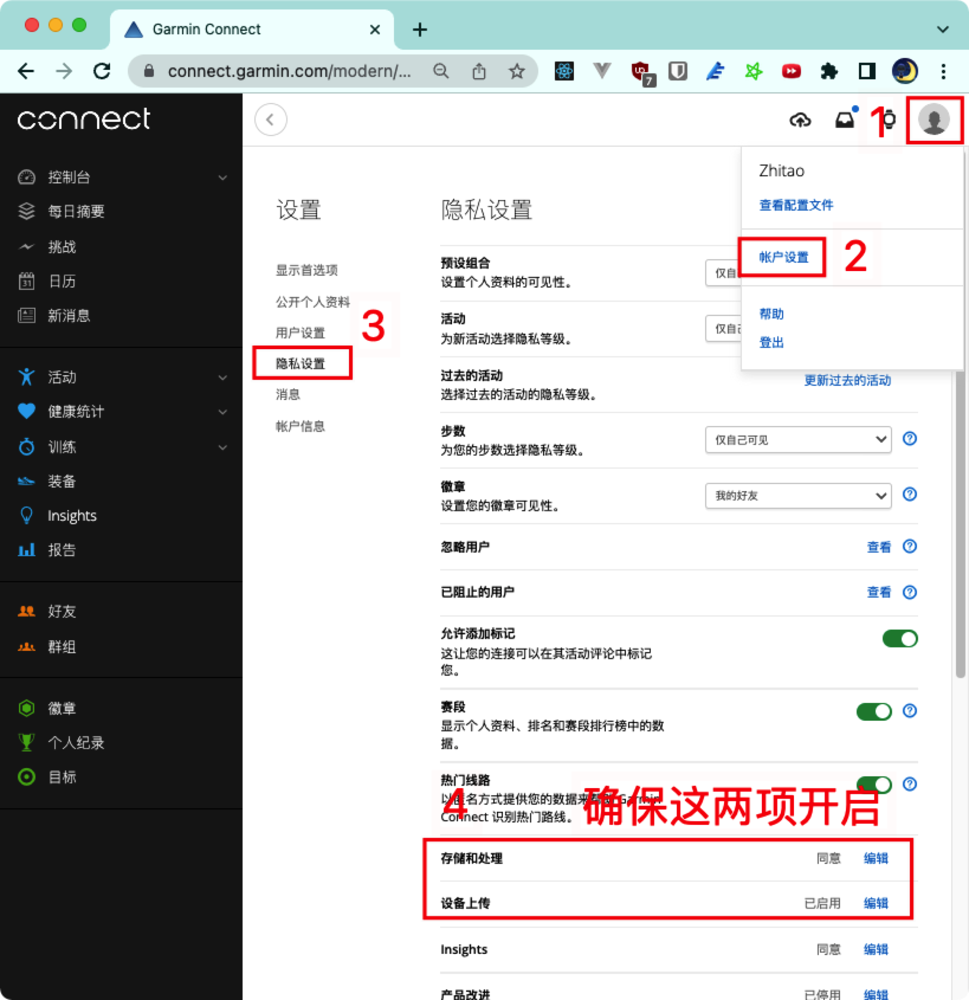

#### Step1: fork 此工程

点击【Fork】，**也请顺手点一下【Fork】旁边的【Star】，支持一下作者** ，fork到自己账号下。
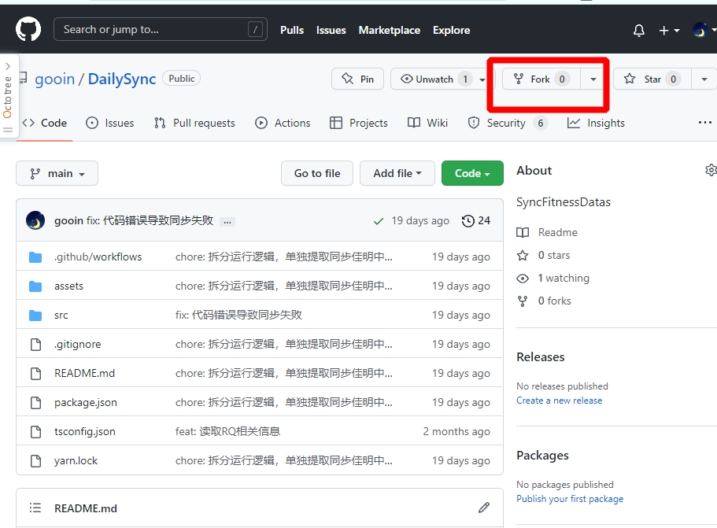

#### Step2: 配置填入自己的佳明国内区、国际区账号及密码

如下图打开Secrets配置，点击 【New repository secret】
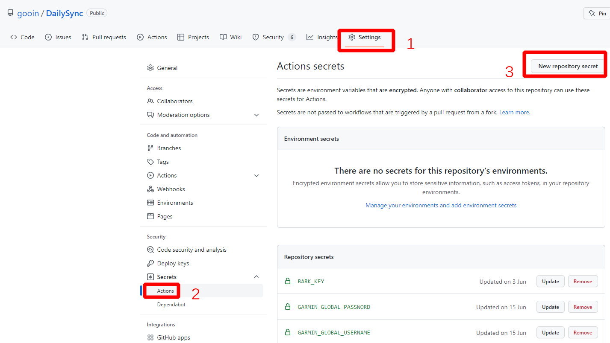

准备自己的帐号密码及要迁移的数据量

**佳明国内账号邮箱地址**：
GARMIN_USERNAME

**佳明国内账号密码**：
GARMIN_PASSWORD

**佳明国际账号邮箱地址**：
GARMIN_GLOBAL_USERNAME

**佳明国际账号密码**：
GARMIN_GLOBAL_PASSWORD

请先在connect网站看看要迁移的活动，写一个大概的数量： https://connect.garmin.cn/modern/activities

**要迁移的活动数量，先填1**:
GARMIN_MIGRATE_NUM

**从第几个活动开始迁移，先填 0**:
GARMIN_MIGRATE_START

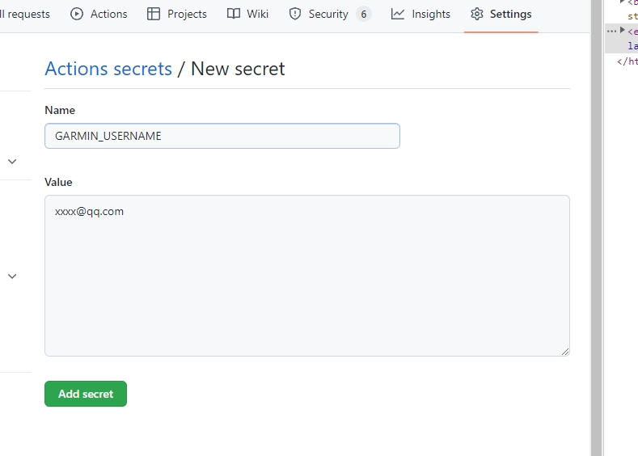

填完后确保如下图红框内的都填上了, 红框外的不用管

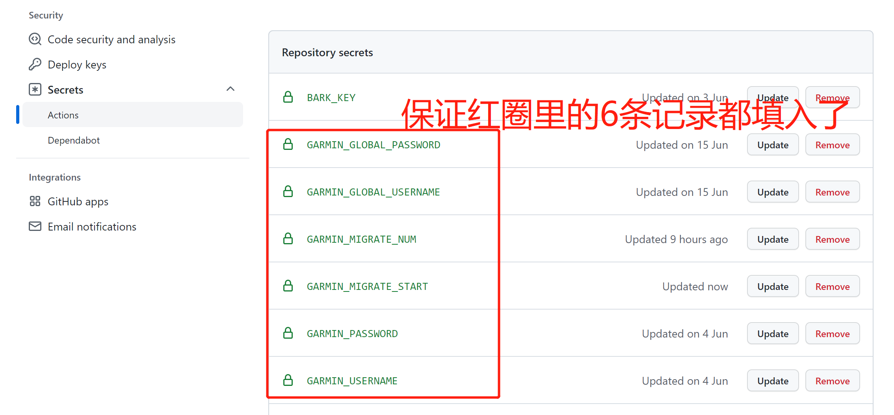

#### Step3: 手动迁移已有数据

如下图，点击【Actions】--> 【 Migrate Garmin CN to Garmin 】 --> 【Run workflow】执行迁移数据
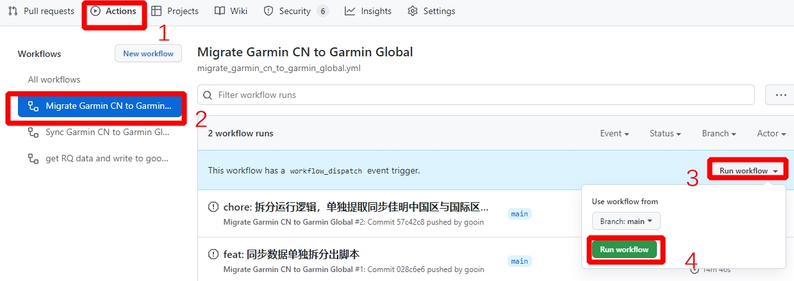
点击后刷新页面，可以看到正在执行的任务：
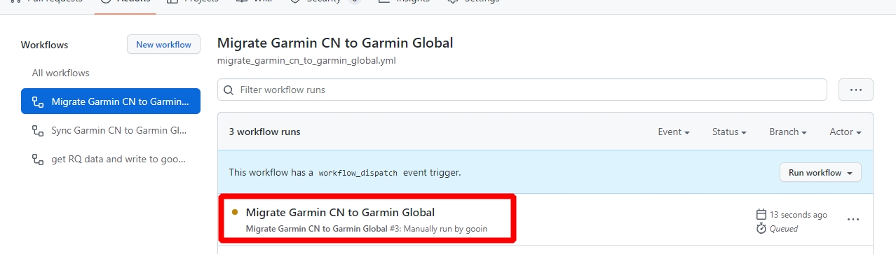
点进去后可以查看日志，如果 Run yarn migrate那一栏看到 userInfo cn 和 userInfo Global, 并且数据持续在滚动刷新，就说明正常运行
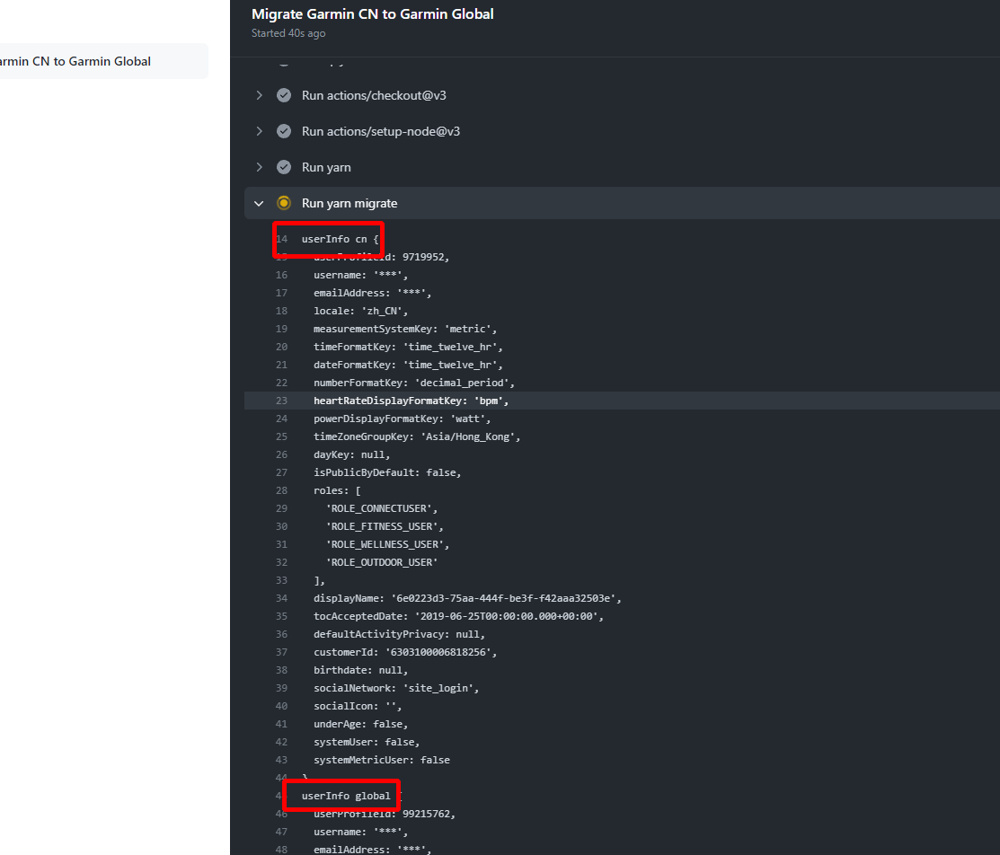
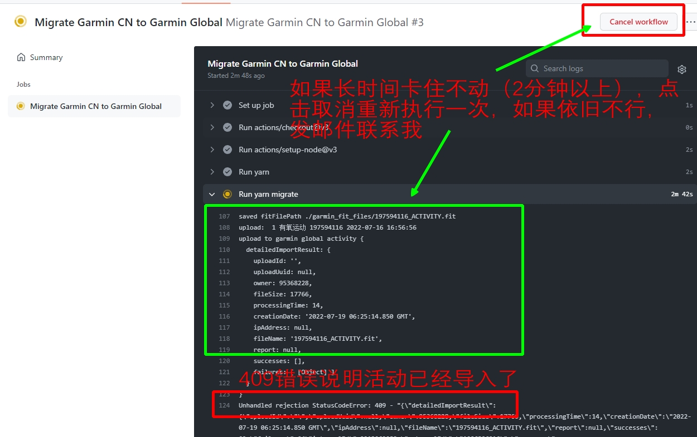

如果上面一切正常，运行结束后，前面会是一个绿色，代表运行完成。
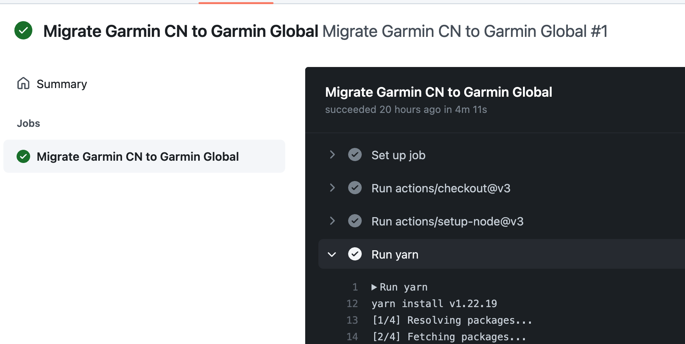

这个时候，去佳明国际区和strava看看，是否有1条数据迁移过来，如果没有，代表有问题，请联系我咨询，如果有，代表正常运行。

(这一块如果看文字不是很清楚到话去看看文章开始部分的视频教程，参照看看)

上面正常的话开始迁移剩余数据

**回到 Step2 的地方，分别修改**

GARMIN_MIGRATE_NUM 为 100

GARMIN_MIGRATE_START 为 1

然后按照上面执行过的步骤，参照Step3再执行一次，执行成功后检查佳明国际区及Strava上是否迁移过来。如果成功，修改

GARMIN_MIGRATE_START 为 100，再次执行，确认成功后，每次 GARMIN_MIGRATE_START 的值 + 100，直到所有数据迁移完成。

> 迁移数据比较慢，请耐心等待，实测30分钟迁移100条左右

#### Step4: 自动同步新的运动数据

如图点击开启workflow
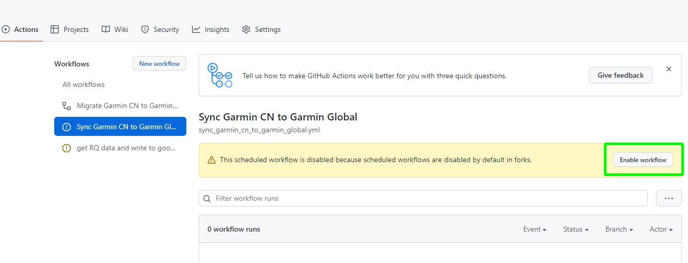
开启后无需额外配置，大约每20分钟左右自动同步一次数据，一段时间后可以查看同步记录
如果有问题，请发邮件联系我
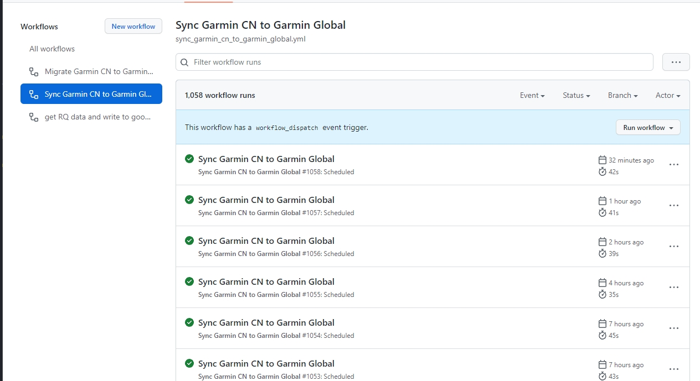

#### FAQ:
##### 数据没有同步成功？

第一步请先检查手机connect，确保运动在connect看到才能进行后续的同步工作。

还有可能是定时执行没有执行，可以像执行MIGRATE那样手动执行SYNC脚本手动触发同步。

##### 数据同步为什么没有按计划执行，有的时候一小时才执行了2次？

参考： [Schedule every 5 mins but runs a bit randomly](https://github.community/t/schedule-every-5-mins-but-runs-a-bit-randomly/159355/2)

原因： github的定时计划任务以尽力而为的策略运行。

**我代码中写的是每10分钟执行一次，实际情况是大约每20分钟执行一次。**

尤其是早上8点左右，几乎都会延迟很久执行，原因是大概我们8点对应美国0点，其他很多程序的定时任务在0点执行，导致我们的任务抢不到计算资源，导致延迟执行。 着急的话上来手动执行一下就好。

文中建议改为每5分钟一次，但是如果这样的话会超出每月的免费可用额度。如果您急切的想同步数据，建议上来手动操作一下。

翻译：
>
> 欢迎来到 GitHub 支持社区！计划的操作工作流以尽力而为的策略运行。当您的计划到期时，您的工作流将添加到池中并在资源可用时运行。这意味着您可能会看到与您的计划时间和工作流运行的实际时间相比有所延迟，尽管这可能会导致更长的延迟，具体取决于当时可用的资源。
> 您可以安排工作流运行的最短时间为每 5 分钟一次。由于这种池化，如果在您的下一个计划设置为运行时，池中已经有运行等待，您可能会看到运行被“跳过”。
> 工程团队正在研究提高调度的可用性、扩展性和响应时间，但如果您需要精确的调度操作，那么您可能会更好地寻找替代解决方案，例如在您自己的 VPS 上运行 cron。
>

##### 需要每天都来同步数据吗？

不用。上面的步骤执行过后，MIGRATE手动迁移已有数据，再有新跑的数据会在SYNC中大约每20分钟左右自动同步一次数据

##### 同步最新的代码库

代码可能有优化更新，如看到下图的情况，请点击下图红框更新到最新的代码，
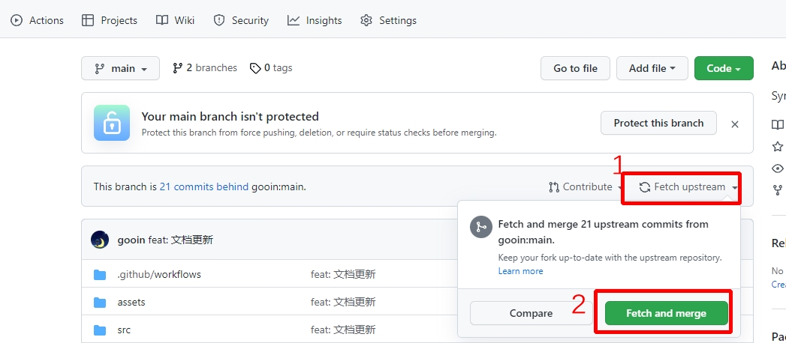

### 采集RQ数据到GoogleSheets

略麻烦，跑友们有需要再补充

## 数据同步到佳明国际区后，其他的一些可关联的运动分析平台

[https://app.trainingpeaks.com/#home](https://app.trainingpeaks.com/#home)

[https://runalyze.com/dashboard](https://runalyze.com/dashboard)

[https://intervals.icu/](https://intervals.icu/)

## 同步到佳明国际区，同步Strava

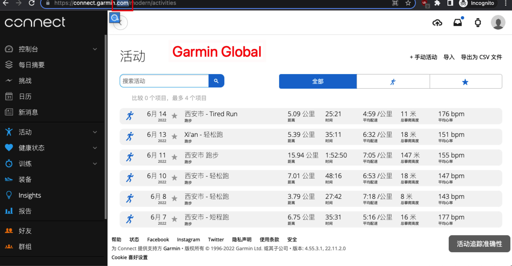
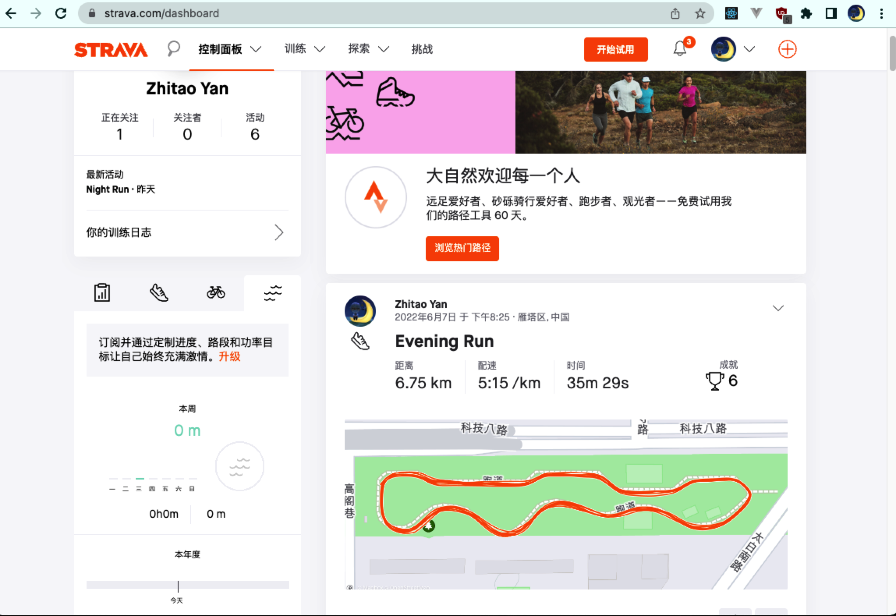

## 采集RQ数据：

[https://www.runningquotient.cn/](https://www.runningquotient.cn/) 是一个专业的跑步数据分析网站，提供的对跑者的"跑力"分析对我来说相当准确。
基本会员至多查詢42天內的跑力變化，更长时间（60，90，180）需要白金会员（RMB ¥60/月）才能看到， 故萌生了采集数据记录到表格自己统计到想法，配合Connect的详细统计数据，可以分析自己的跑步能力长期趋势。

同步佳明中国区运动数据到佳明国际区，Strava关联佳明国际区账号，进而实现strava跑步数据同步更新。

## 前置条件：

- runningquotient 已关联运动手表的账号
- 佳明手表 （如果仅采集跑力数据，其他能关联到rq的手表都行，华为/高驰/...）
- 二代跑步数据 (触地时间，步幅，垂直震幅，功率) 采集设备（Garmin RDP/HRM-PRO/HRM-RUN）
- Google Sheets（记录数据）/ Google Cloud Platform API (用于写入表格数据)

## 采集的数据：

- RQ：
    - '跑力更新时间', '训练负荷', '疲劳', '即时跑力', '跑力', '跑力说明', '趋势1', '趋势2',
- Garmin Connect
    - '活动id', '活动名称', '活动开始时间', '距离', '持续时间', '速度 m/s', '配速 min/km', '配速文字 min/km', '平均心率', '最大心率', '平均每分钟步频', '有氧效果', '
      无氧效果', '触地时间', '步幅', 'VO2Max', '垂直振幅', '垂直振幅比', '触地平衡', '训练效果', '训练负荷'

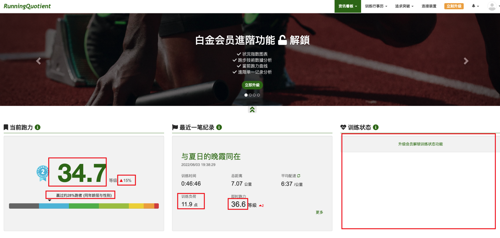
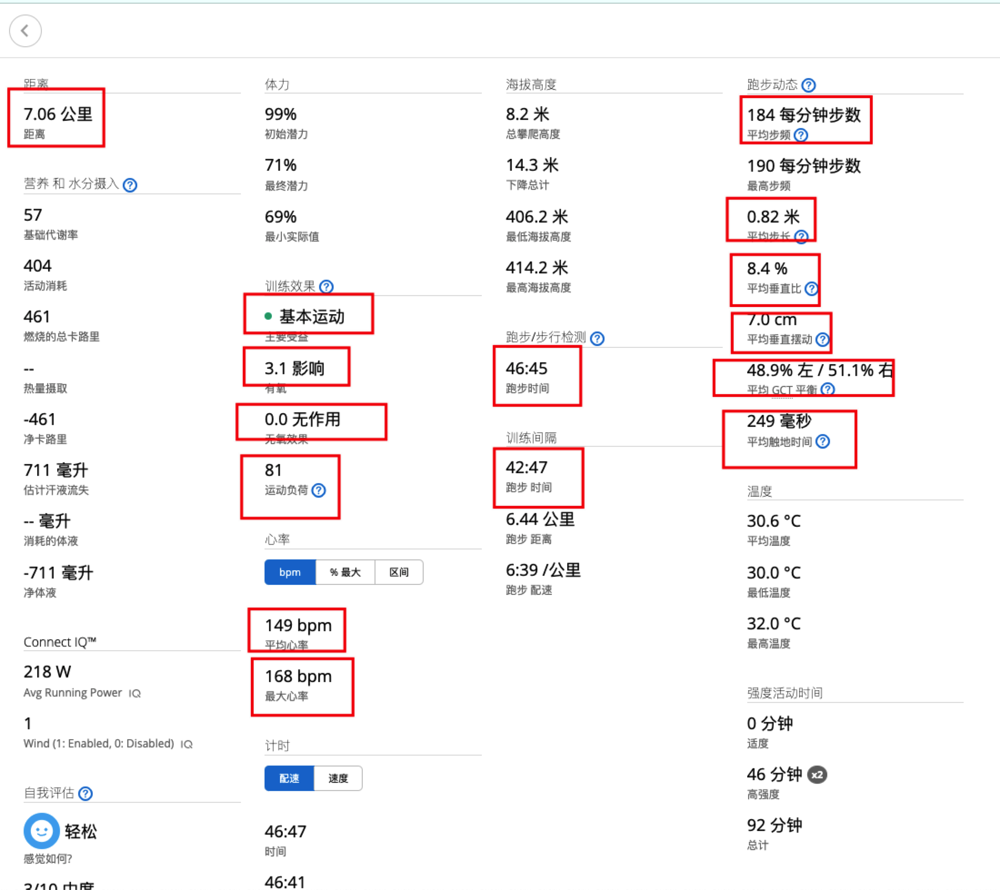
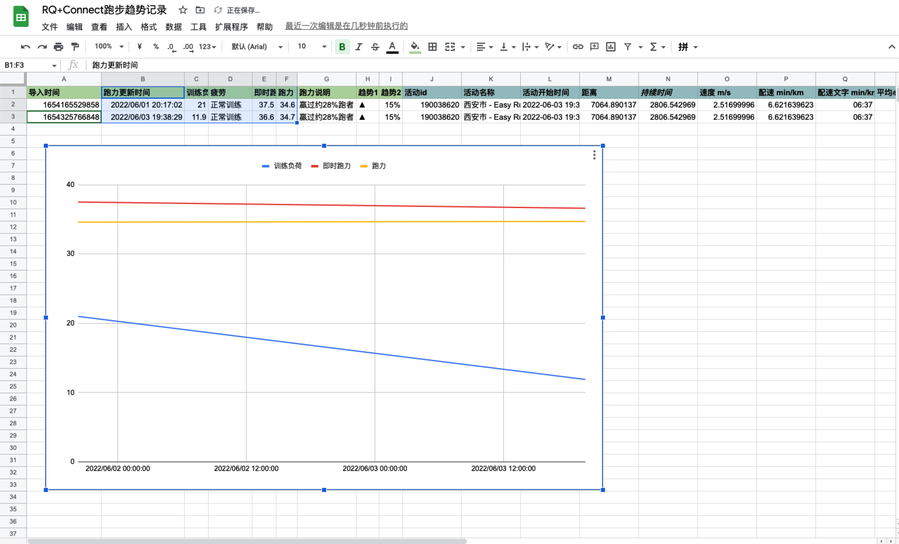

分享我自己的跑步数据：
[点击打开表格查看](https://docs.google.com/spreadsheets/d/e/2PACX-1vRSk3aD6T3tFM-OA7Cl5BmFMJ7mdKriFgYvNQA6f5b8K6F_-CadaGa8TEjMmy-sIpOPfmdN1ktkhXxt/pubhtml?gid=0&single=true)

## Star History

## Buy Me a Coffee

如果你觉得我的工作帮到了你，可赠予我一杯咖啡，感谢~

### 支持者记录

|     姓名     | 金额(￥) |
|:----------:|:-----:|
| Monk****IN |  50   |
|   Cl**N    |  50   |
|   無敵**十    |  50   |
|     *弟     |  50   |
|   S**en    |  66   |
|    C**2    | 8.88  |
|    星**烂    |  30   |
|    李*牛     |  15   |
|     狼*     | 16.18 |
|     刘      |  50   |
|    A*w     |  50   |
|     *昱     |  20   |

