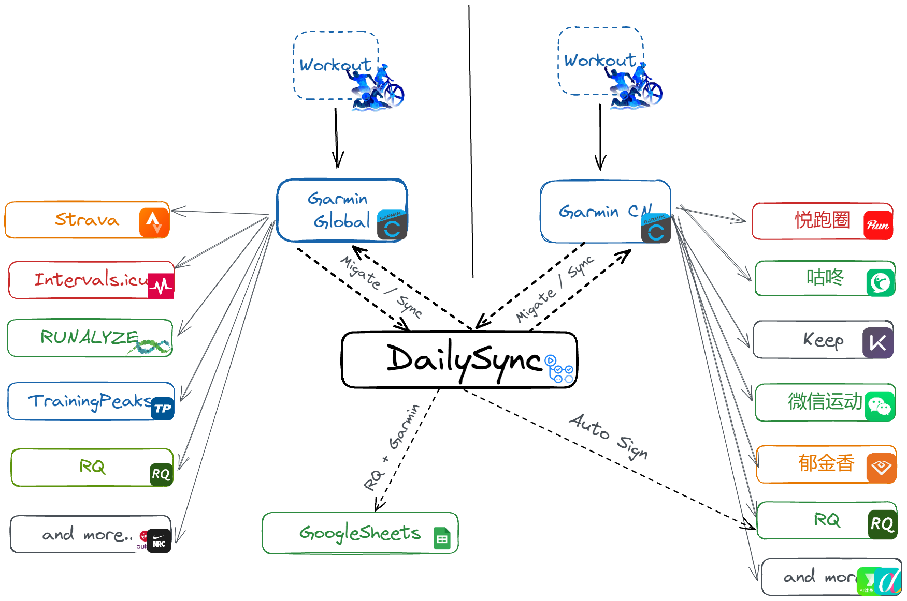
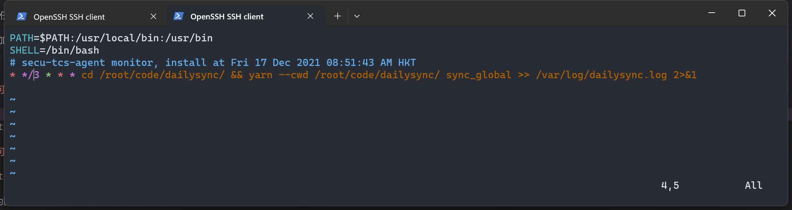
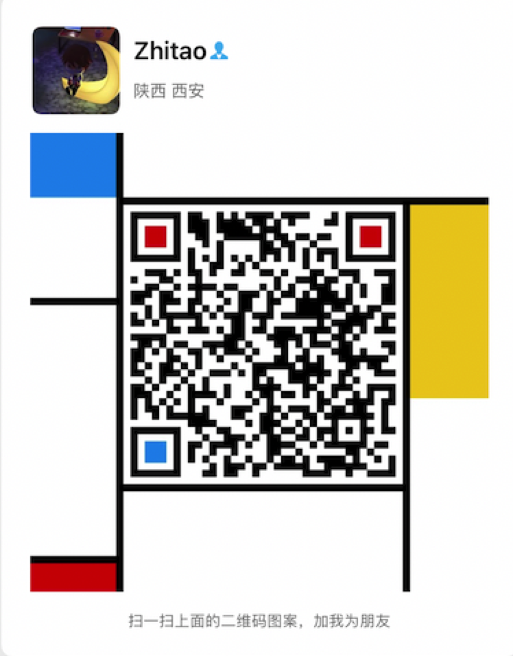

# 佳明运动数据同步与采集工具




<a style="display:inline-block;background-color:#FC5200;color:#fff;padding:5px 10px 5px 30px;font-size:11px;font-family:Helvetica, Arial, sans-serif;white-space:nowrap;text-decoration:none;background-repeat:no-repeat;background-position:10px center;border-radius:3px;background-image:url('https://badges.strava.com/logo-strava-echelon.png')" href='https://strava.com/athletes/84396978' target="_clean">
  关注作者Strava
  
</a>


[](https://t.me/garmindailysync)


## Web版本
如果你不熟悉代码，强烈推荐使用这个版本，在网页上填入账号点击就能同步数据，简洁好用。
[https://dailysync.vyzt.dev/](https://dailysync.vyzt.dev/)


## Github运行方案
因为项目之前在Github上占用过多资源被封禁，现在已经调整了执行的频率，熟悉代码的话，将代码下载下来，上传到github，通过 github Actions执行
具体参考下方文档或参考视频教程: https://www.bilibili.com/video/BV1v94y1Q7oR/?spm_id_from=333.999.0.0

## 使用前账号准备与配置

【重要重要重要！！！】请先参照 [账号准备](https://dailysync.vyzt.dev/docs/%E8%B4%A6%E5%8F%B7%E5%87%86%E5%A4%87) 进行账号配置，再来使用此工具

## 本地运行方案
首先确保运行此脚本的机器能够访问国际互联网, 如国外VPS、家庭全局科学的环境等， 否则无法正常登录佳明国际区

## 检查网络情况确保正常访问佳明服务

### 测试国际互联网网络连通性
```shell
wget google.com
```
执行后确保相应的数据类似如下再进行下面步骤，否则请检查网络环境（命令行也需要能访问国际互联网, 如果google在浏览器能正常访问，但是命令行无法ping通，google搜索关键词**命令行翻墙**，参考配置一下重试。） 如果用的时Clash，在左侧 General 下，将 TUN Mode 模式开启也可。
```shell
root@home:~# wget google.com

StatusCode        : 200
StatusDescription : OK
Content           : <!doctype html><html itemscope="" itemtype="http://schema.org/WebPage" lang="zh-HK"><head><meta con
                    tent="text/html; charset=UTF-8" http-equiv="Content-Type"><meta content="/images/branding/googleg/1
                    x/...
RawContent        : HTTP/1.1 200 OK
                    Connection: close
                    Conts...
Forms             : {f}
Headers           : {[ https://csp.withgoogle.com/csp/gws/other-hp], [Cache-Control, private, max
                    -age=0], [Content-Type, text/html; charset=UTF-8]...}
Images            : {@{innerHTML=; n value=zh-HK name=hl>; outerText=; tagName=I
                    NPUT; th}...}
Links             : {@{i id=gb_78; class=gbzt;
                     href=https://play.google.com/?hl=zh-TW&amp;tab=w8}...}
ParsedHtml        : mshtml.HTMLDocumentClass
RawContentLength  : 52716
```    
如果是如下显示则代表网络没有配置好，请先按上面说的方法解决再试。
```shell
root@home:~# wget google.com

--2023-07-06 20:26:18--  http://google.com/
Resolving google.com (google.com)... 142.251.42.238
Connecting to google.com (google.com)|142.251.42.238|:80... failed: Connection timed out.
Retrying.
```
### 测试佳明国际区网络连通性
```shell
ping sso.garmin.com
```
```shell
root@home:~# ping sso.garmin.com
PING sso.garmin.com.cdn.cloudflare.net (104.17.113.66) 56(84) bytes of data.
64 bytes from 104.17.113.66 (104.17.113.66): icmp_seq=1 ttl=63 time=1.92 ms
64 bytes from 104.17.113.66 (104.17.113.66): icmp_seq=2 ttl=63 time=1.27 ms
64 bytes from 104.17.113.66 (104.17.113.66): icmp_seq=3 ttl=63 time=2.43 ms

--- sso.garmin.com.cdn.cloudflare.net ping statistics ---

```
### 测试中国区网络连通性
```shell
ping sso.garmin.cn
```
```shell
root@home:~# ping sso.garmin.cn
PING sso.garmin.cn (61.150.74.194) 56(84) bytes of data.
64 bytes from 61.150.74.194: icmp_seq=1 ttl=63 time=1.69 ms
64 bytes from 61.150.74.194: icmp_seq=2 ttl=63 time=2.77 ms
64 bytes from 61.150.74.194: icmp_seq=3 ttl=63 time=7.12 ms

--- sso.garmin.cn ping statistics ---

```


### 安装 `NodeJS`

下载地址 [https://nodejs.org/en/](https://nodejs.org/en/)
### 开启 `yarn` 

`NodeJS` 安装完毕后，新打开一个管理员命令行窗口， 输入命令执行

```shell
corepack enable
```

### 安装依赖
在`README.md`同级目录打开命令行，执行

Windows在文件管理器中打开脚本所在的目录，在地址栏输入 `cmd` 然后回车，即可打开命令行，这个步骤不需要管理员权限

```shell
yarn
```
### 填入账号密码
打开 `src/constant.ts`,
填入您的佳明账号及密码
```js
//中国区
export const GARMIN_USERNAME_DEFAULT = 'example@example.com';
export const GARMIN_PASSWORD_DEFAULT = 'password';
//国际区
export const GARMIN_GLOBAL_USERNAME_DEFAULT = 'example@example.com';
export const GARMIN_GLOBAL_PASSWORD_DEFAULT = 'password';

// 佳明迁移数量配置（批量同步历史数据使用）
export const GARMIN_MIGRATE_NUM_DEFAULT = 100; //每次要迁移的数量，不要填太大
export const GARMIN_MIGRATE_START_DEFAULT = 0; // 从第几条活动开始

```

### 运行脚本
注意： 如果执行不能成功，请尝试将梯子更换为美国IP，多更换几个ip试试

同步中国区到国际区
```shell
yarn sync_cn
```
同步国际区到中国区
```shell
yarn sync_global
```
迁移历史数据：中国区到国际区
```shell
yarn migrate_garmin_cn_to_global
```
迁移历史数据：国际区到中国区
```shell
yarn migrate_garmin_global_to_cn
```

#### 常见问题

如果上面ping都正常，却仍然不能正常运行，请尝试将梯子更换为美国IP

## 定时任务(Linux Only)
上面手动执行名称成功迁移后，可以添加定时任务来自动执行

`crontab -e` 打开定时任务编辑，按需添加： 

### 每3小时检查并同步国际区到中国区【可选】,注意PATH和SHELL两行也要写上
```cron
PATH=$PATH:/usr/local/bin:/usr/bin
SHELL=/bin/bash
* */3 * * * cd /root/code/dailysync/ && yarn --cwd /root/code/dailysync/ sync_global >> /var/log/dailysync.log 2>&1
```
### 每3小时检查并同步中国区到国际区【可选】,注意PATH和SHELL两行也要写上
```cron
PATH=$PATH:/usr/local/bin:/usr/bin
SHELL=/bin/bash
* */3 * * * cd /root/code/dailysync/ && yarn --cwd /root/code/dailysync/ sync_cn >> /var/log/dailysync.log 2>&1
```
其中 `/root/code/dailysync/`为脚本在机器上的目录地址，更换为您机器上的目录即可



### 运行日志查看

```shell
tail -100f /var/log/dailysync.log
```

### 修改定时任务执行频率
当前为 `*/10 * * * *` 每 10 分钟执行一次

您可以按需修改， 参考网址 [https://crontab.guru/examples.html](https://crontab.guru/examples.html)

列举几个常用的：

每小时执行一次： `0 * * * *`

每6小时执行一次： `0 */6 * * *`

每12小时执行一次： `0 */12 * * *`


------------


**自动 安全 省心**

**如果看不到此文档的图片，请移步 [知乎链接](https://zhuanlan.zhihu.com/p/543799435)**

此工具实现了佳明运动活动数据（生理数据如睡眠，身体电量，**步数**
等除外）的一次性迁移与日常运动数据同步，实现同步运动数据到到Strava [Strava全球热图](https://www.strava.com/heatmap) 。 额外还实现了RQ数据采集记录跑力的长期趋势及自动签到。

## 功能

### 迁移数据

- 支持佳明账号中已有的运动数据从中国区一次性迁移到国际区。对应 `Action`: `Migrate Garmin CN to Garmin Global`
- 支持佳明账号中已有的运动数据从国际区一次性迁移到中国区。对应 `Action`: `Migrate Garmin Global to Garmin CN`

### 同步数据

- 约每20分钟左右检查当前中国区账号中是否有新的运动数据，如有则自动下载上传到国际区，并同步到Strava。 对应 `Action`: `Sync Garmin CN to Garmin Global`
- 如果您常用的是国际区，想要在国内运动软件（悦跑圈/咕咚/keep/郁金香等等）同步运动数据及微信运动中显示 【Garmin手表 骑行xx分钟】（[微信运动效果](./assets/wx_sport.jpg)）
  此工具可以实现自动反向同步中国区。 对应 `Action`: `Sync Garmin Global to Garmin CN`
  - 微信步数同步：
    - `iOS`: 佳明爱运动小程序绑定后，国际区->中国区同步仅能同步活动数据。出去运动不带手机的话，步数会记录在手表中，活动同步后，`Connect`会将步数上传到`健康` App 中，微信与健康应用链接，即可在微信运动中看到步数。
    - `Android`: 暂无可行方法。
- 如无特殊需求，强烈建议不要将两个同步脚本同时打开，按需开启一个即可！ 

## 说明

#### 免责声明：

本工具仅限用于学习和研究使用，不得用于商业或者非法用途。如有任何问题可联系本人删除。

#### 账号安全：

账号及密码保存在自己的 `github secrets` 中，不会泄露，运行代码均 **开放源码**，欢迎提交`PR`。

#### 进群讨论

为方便讨论，请加我绿色软件：nononopass （下面扫码）我拉你进群。`nononopass`  我拉你进群。

