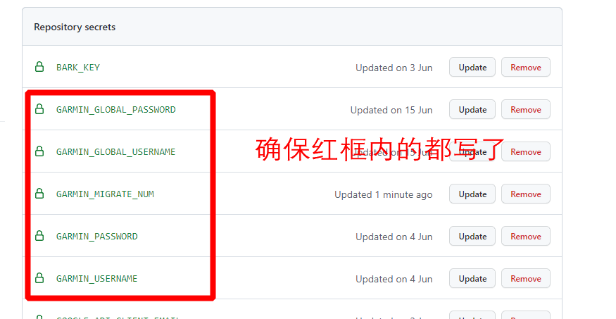

# 佳明运动数据同步与采集工具

<a style="display:inline-block;background-color:#FC5200;color:#fff;padding:5px 10px 5px 30px;font-size:11px;font-family:Helvetica, Arial, sans-serif;white-space:nowrap;text-decoration:none;background-repeat:no-repeat;background-position:10px center;border-radius:3px;background-image:url('https://badges.strava.com/logo-strava-echelon.png')" href='https://strava.com/athletes/84396978' target="_clean">
  关注作者
  
</a>

自动 安全 省心

此工具实现了佳明国内版运动数据与国际区的同步，进而与国际接轨（笑），同步到Strava。

额外还实现了RQ数据采集记录跑力的长期趋势

安全：
账号及密码保存在自己的 github secrets 中，不会泄露，运行代码均开放源码

## 如何使用？

### 同步到佳明国际区，同步Strava

前置条件：**注册好佳明国际区的帐号及Strava账号，并已经将Strava与佳明国际区账号关联。**

思路： Strava仅支持关联国际区的佳明账号，所以需要提前自己创建国际区佳明账号，并用此账号关联绑定Strava

流程：

【运动】--> GarminCN --> This Tool ⚡ --> Garmin Global --> Strava

同步方法： 
先迁移国区数据到国际区，然后开启同步数据，每15分钟自动同步一次数据，实现无缝与Strava同步数据

#### Step1: fork 此工程
点击【Fork】，fork到自己账号下
  

#### Step2: 配置填入自己的佳明国内区、国际区账号及密码

如下图打开Secrets配置，点击 【New repository secret】

准备自己的帐号密码及要迁移的数据量

佳明国内账号邮箱地址：
GARMIN_USERNAME

佳明国内账号密码：
GARMIN_PASSWORD

佳明国际账号邮箱地址：
GARMIN_GLOBAL_USERNAME

佳明国际账号密码：
GARMIN_GLOBAL_PASSWORD

请先在connect网站看看要迁移的活动，写一个大概的数量： https://connect.garmin.cn/modern/activities

要迁移的活动数量:
GARMIN_MIGRATE_NUM

填完后确保如下图红框内的都填上了, 红框外的不用管

#### Step3: 手动迁移已有数据
如下图，点击【Actions】--> 【 Migrate Garmin CN to Garmin 】 --> 【Run workflow】执行迁移数据

点击后刷新页面，可以看到正在执行的任务：

点进去后可以查看日志：

> 迁移数据比较慢，请耐心等待，实测15分钟迁移200条左右
> 
#### Step4: 自动同步新的运动数据
如图点击开启workflow

开启后无需额外配置，每15分钟自动同步一次，一段时间后可以查看同步记录
如果有问题，请发邮件联系我

### 采集RQ数据到GoogleSheets
略麻烦，跑友们有需要再补充

## 同步到佳明国际区，同步Strava

## 采集RQ数据：

[https://www.runningquotient.cn/](https://www.runningquotient.cn/) 是一个专业的跑步数据分析网站，提供的对跑者的"跑力"分析对我来说相当准确。
基本会员至多查詢42天內的跑力變化，更长时间（60，90，180）需要白金会员（RMB ¥60/月）才能看到， 故萌生了采集数据记录到表格自己统计到想法，配合Connect的详细统计数据，可以分析自己的跑步能力长期趋势。

同步佳明中国区运动数据到佳明国际区，Strava关联佳明国际区账号，进而实现strava跑步数据同步更新。

## 前置条件：

- runningquotient 已关联运动手表的账号
- 佳明手表 （如果仅采集跑力数据，其他能关联到rq的手表都行，华为/高驰/...）
- 二代跑步数据 (触地时间，步幅，垂直震幅，功率) 采集设备（Garmin RDP/HRM-PRO/HRM-RUN）
- Google Sheets（记录数据）/ Google Cloud Platform API (用于写入表格数据)

## 采集的数据：

- RQ：
  - '跑力更新时间', '训练负荷', '疲劳', '即时跑力', '跑力', '跑力说明', '趋势1', '趋势2',
- Garmin Connect
  - '活动id', '活动名称', '活动开始时间', '距离', '持续时间', '速度 m/s', '配速 min/km', '配速文字 min/km', '平均心率', '最大心率', '平均每分钟步频', '有氧效果', '
    无氧效果', '触地时间', '步幅', 'VO2Max', '垂直振幅', '垂直振幅比', '触地平衡', '训练效果', '训练负荷'

分享我自己的跑步数据：
[点击打开表格查看](https://docs.google.com/spreadsheets/d/e/2PACX-1vRSk3aD6T3tFM-OA7Cl5BmFMJ7mdKriFgYvNQA6f5b8K6F_-CadaGa8TEjMmy-sIpOPfmdN1ktkhXxt/pubhtml?gid=0&single=true)

## Buy Me a Coffee
如果你觉得我的工作帮到了你，可赠予我一杯咖啡，感谢~

