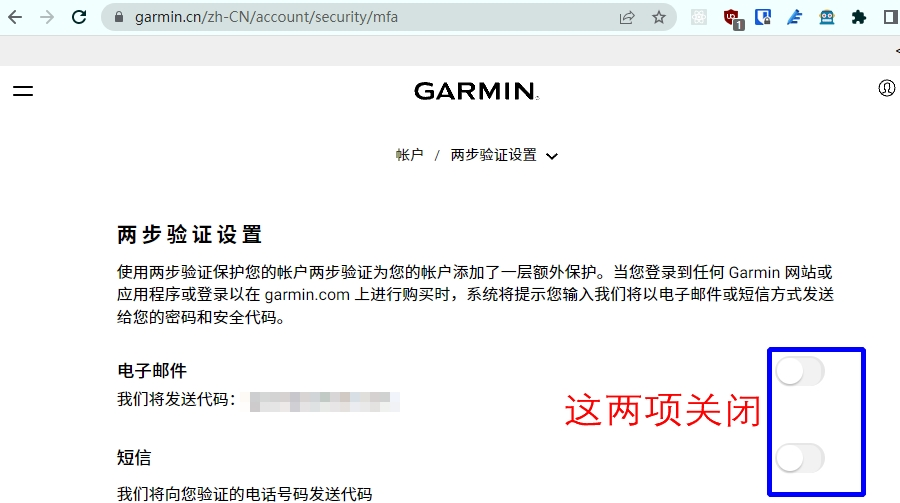
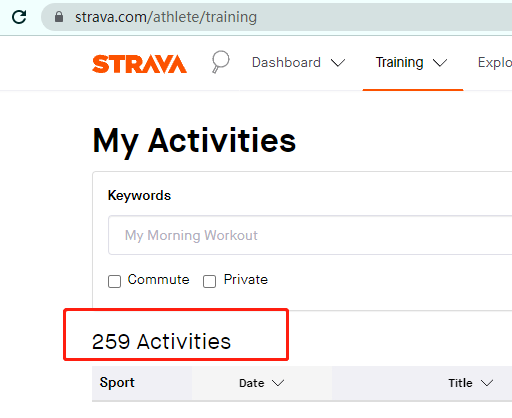
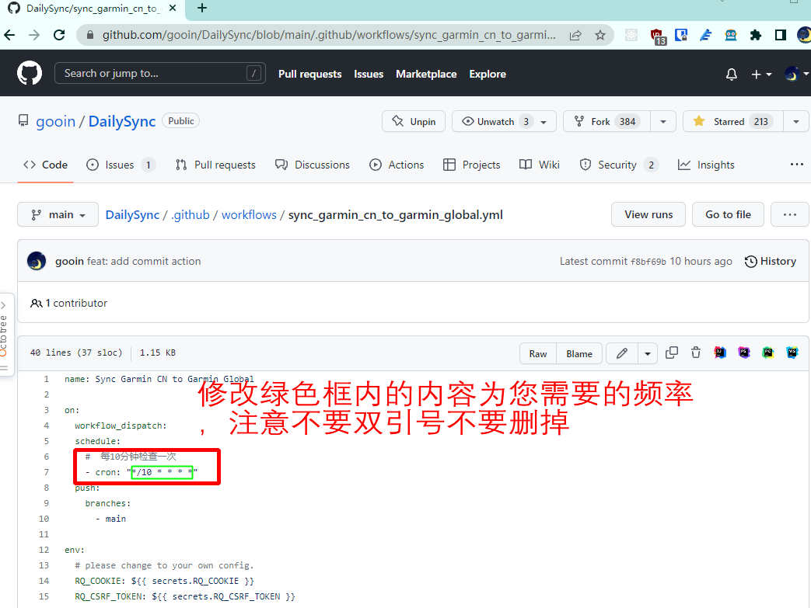
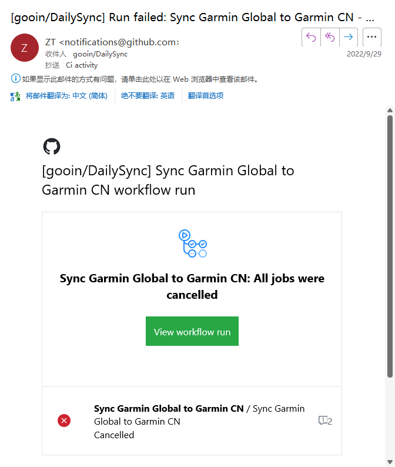
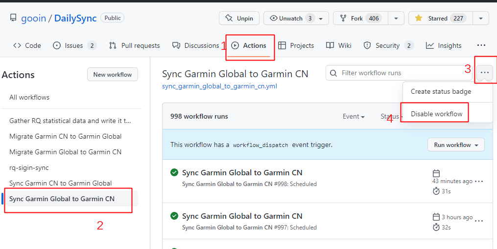

# 佳明运动数据同步与采集工具


<a style="display:inline-block;background-color:#FC5200;color:#fff;padding:5px 10px 5px 30px;font-size:11px;font-family:Helvetica, Arial, sans-serif;white-space:nowrap;text-decoration:none;background-repeat:no-repeat;background-position:10px center;border-radius:3px;background-image:url('https://badges.strava.com/logo-strava-echelon.png')" href='https://strava.com/athletes/84396978' target="_clean">
  关注作者Strava
  
</a>


[](https://t.me/garmindailysync)


## 本地运行方案
首先确保运行此脚本的机器能够访问国际互联网, 如国外VPS、家庭全局科学的环境等， 否则无法正常登录佳明国际区

## 检查网络情况确保正常访问佳明服务

### 测试国际互联网与佳明国际区网络连通性
```shell
ping google.com
ping sso.garmin.com
```
执行后确保能像如下显示再进行下面步骤，否则请检查网络环境（命令行也需要能访问国际互联网, 如果google在浏览器能正常访问，但是命令行无法ping通，google搜索关键词“命令行翻墙”，参考配置一下重试）
```shell
root@home:~# ping sso.garmin.com
PING sso.garmin.com.cdn.cloudflare.net (104.17.113.66) 56(84) bytes of data.
64 bytes from 104.17.113.66 (104.17.113.66): icmp_seq=1 ttl=63 time=1.92 ms
64 bytes from 104.17.113.66 (104.17.113.66): icmp_seq=2 ttl=63 time=1.27 ms
64 bytes from 104.17.113.66 (104.17.113.66): icmp_seq=3 ttl=63 time=2.43 ms

--- sso.garmin.com.cdn.cloudflare.net ping statistics ---

```
### 测试中国区网络连通性
```shell
ping sso.garmin.cn
```
```shell
root@home:~# ping sso.garmin.cn
PING sso.garmin.cn (61.150.74.194) 56(84) bytes of data.
64 bytes from 61.150.74.194: icmp_seq=1 ttl=63 time=1.69 ms
64 bytes from 61.150.74.194: icmp_seq=2 ttl=63 time=2.77 ms
64 bytes from 61.150.74.194: icmp_seq=3 ttl=63 time=7.12 ms

--- sso.garmin.cn ping statistics ---

```


### 安装 `NodeJS`

下载地址 [https://nodejs.org/en/](https://nodejs.org/en/)
### 开启 `yarn` 

`NodeJS` 安装完毕后，新打开一个管理员命令行窗口， 输入命令执行

```shell
corepack enable
```

### 安装依赖
在`README.md`同级目录打开命令行，执行

Windows在文件管理器中打开脚本所在的目录，在地址栏输入 `cmd` 然后回车，即可打开命令行，这个步骤不需要管理员权限

```shell
yarn
```
### 填入账号密码
打开 `src/constant.ts`,
填入您的佳明账号及密码

### 运行脚本
注意： 如果执行不能成功，请尝试将梯子更换为美国IP，多更换几个ip试试

同步中国区到国际区
```shell
yarn sync_cn
```
同步国际区到中国区
```shell
yarn sync_global
```
#### 常见问题

如果上面ping都正常，却仍然不能正常运行，请尝试将梯子更换为美国IP

## 定时任务(Linux Only)
上面手动执行名称成功迁移后，可以添加定时任务来自动执行

`crontab -e` 打开定时任务编辑，按需添加： 

### 每10分钟检查并同步国际区到中国区【可选】
```cron
*/10 * * * * yarn --cwd /home/root/code/DailySync/ sync_global
```
### 每10分钟检查并同步中国区到国际区【可选】
```cron
*/10 * * * * yarn --cwd /home/root/code/DailySync/ sync_cn
```
其中 `/home/root/code/DailySync/`为脚本在机器上的目录地址，更换为您机器上的目录即可

### 修改定时任务执行频率
当前为 `*/10 * * * *` 每 10 分钟执行一次

您可以按需修改， 参考网址 [https://crontab.guru/examples.html](https://crontab.guru/examples.html)

列举几个常用的：

每小时执行一次： `0 * * * *`

每6小时执行一次： `0 */6 * * *`

每12小时执行一次： `0 */12 * * *`


------------


**自动 安全 省心**

**如果看不到此文档的图片，请移步 [知乎链接](https://zhuanlan.zhihu.com/p/543799435)**

此工具实现了佳明运动活动数据（生理数据如睡眠，身体电量，**步数**
等除外）的一次性迁移与日常运动数据同步，实现同步运动数据到到Strava [Strava全球热图](https://www.strava.com/heatmap) 。 额外还实现了RQ数据采集记录跑力的长期趋势及自动签到。

## 功能

### 迁移数据

- 支持佳明账号中已有的运动数据从中国区一次性迁移到国际区。对应 `Action`: `Migrate Garmin CN to Garmin Global`
- 支持佳明账号中已有的运动数据从国际区一次性迁移到中国区。对应 `Action`: `Migrate Garmin Global to Garmin CN`

### 同步数据

- 约每20分钟左右检查当前中国区账号中是否有新的运动数据，如有则自动下载上传到国际区，并同步到Strava。 对应 `Action`: `Sync Garmin CN to Garmin Global`
- 如果您常用的是国际区，想要在国内运动软件（悦跑圈/咕咚/keep/郁金香等等）同步运动数据及微信运动中显示 【Garmin手表 骑行xx分钟】（[微信运动效果](./assets/wx_sport.jpg)）
  此工具可以实现自动反向同步中国区。 对应 `Action`: `Sync Garmin Global to Garmin CN`
  - 微信步数同步：
    - `iOS`: 佳明爱运动小程序绑定后，国际区->中国区同步仅能同步活动数据。出去运动不带手机的话，步数会记录在手表中，活动同步后，`Connect`会将步数上传到`健康` App 中，微信与健康应用链接，即可在微信运动中看到步数。
    - `Android`: 暂无可行方法。
- 如无特殊需求，强烈建议不要将两个同步脚本同时打开，按需开启一个即可！ 

### 采集数据

- 采集RQ统计数据到GoogleSheets，记录跑力的长期趋势。参见： [RQ数据采集到GoogleSheets教程](RQ_GoogleSheets.md)
- RQ自动签到。参见：[RQ自动签到](RQ_Sign.md)

## 说明

#### 免责声明：

本工具仅限用于学习和研究使用，不得用于商业或者非法用途。如有任何问题可联系本人删除。

#### 账号安全：

账号及密码保存在自己的 `github secrets` 中，不会泄露，运行代码均 **开放源码**，欢迎提交`PR`。

#### 进群讨论

**因脚本原理为模拟用户登录进行操作，佳明服务有改动就会导致脚本失效，为不影响您的数据同步，强烈建议您加群确保遇到问题能够及时了结及解决。搜索绿色软件账号：`nononopass` （[二维码扫码](./assets/wechat_qr.png)） 我拉你进群。**

#### 支持作者

如果帮助到了你，可以 [Buy Me a Coffee](#buy-me-a-coffee)，赞助者会在文章下方留下ID表示感谢🙏。

#### 关键更新日志

- 2022-10-11：佳明服务器抽风，需要重置密码才能继续使用账号

> 解决方法如下，另外对代码也进行了优化，将登录信息加密存储复用，不必每次执行同步任务都登录一次，所以需要新增一条secrets，见下面解决方法。

```
最近如果收到来自佳明重置密码的邮件（国际区）/短信（中国区），请按照如下方式操作一下（没收到可以先不管，也有可能仅收到国际区的邮件，如果收到就重置对应区的密码）：
1、登录ConnectWeb页面：国际区：https://connect.garmin.com/modern/  中国区：https://connect.garmin.cn/modern
2、然后用邮箱收到的临时密码登录，重置密码，重置密码可以和原来密码相同，但是为了安全还是建议您更换一个新密码
3、如果您在第2步更换了新密码，在Github的secrets中更新 GARMIN_GLOBAL_PASSWORD 的值为国际区新密码，GARMIN_PASSWORD 的值为中国区新密码
4、更新代码，方法见文档FAQ
5、在Github的secrets中新增一条记录，名称 AESKEY ,内容为任意小于32位长度的字符串，用于加密账号登录信息，举例（不要复制使用）：KAD1JLA12SKDJLASDJ
```


- 2022-09-01: 新增支持国际区同步新数据到中国区
  - 新增一个`action`：`Sync Garmin Global to Garmin CN`，开启后自动执行。与同步中国区到国际区操作一致。
- 2022-08-07: 支持国际区迁移数据到中国区
  - 新增一个`action`：`Migrate Garmin Global to Garmin CN`，手动执行。与迁移中国区到国际区操作一致。
- 2022-06-15: 增加佳明中国区迁移及同步国际区数据功能，同步 `strava`
- 2022-06-06: 采集`RQ`统计数据到`Google Sheets`

<details>
<summary>

#### 在用这个工具的大佬们(除了作者)欢迎点进链接加加好友~(点击展开) （[填写您的链接](https://wj.qq.com/s2/10633783/a1ef/)）

</summary>

| 名称            | Strava运动员链接                                   |           |
|:--------------|:----------------------------------------------|:----------|
| Zhitao Yan    | https://www.strava.com/athletes/84396978      | ‍💻Author |
| Clown jiang   | https://www.strava.com/athletes/105952743     | ✨Sponsor  |
| 老弟            | https://www.strava.com/athletes/91478457      | ✨Sponsor  |
| Zax Wen       | https://www.strava.com/athletes/91553718      | ✨Sponsor  |
| 李二牛           | https://www.strava.com/athletes/43684509      | ✨Sponsor  |
| 围脖B站@我是冯瑞恒    | https://www.strava.com/athletes/34349982      | ✨Sponsor  |
| 刘             | https://www.strava.com/athletes/67222235      | ✨Sponsor  |
| 狼朗            | https://www.strava.com/athletes/43107517      | ✨Sponsor  |
| 微醺漂移          | https://www.strava.com/athletes/19108713      | ✨Sponsor  |
| hua xu        | https://www.strava.com/athletes/40855048      |           |
| L.X           | https://www.strava.com/athletes/86727066      |           |
| 姜宁            | https://www.strava.com/athletes/54001163      |           |
| jogging tiger | https://www.strava.com/athletes/105416045     |           |
| Eph           | https://www.strava.com/athletes/8376311       |           |
| YunBond       | https://www.strava.com/athletes/33650658      |           |
| ygnnbpkn      | https://www.strava.com/athletes/107433069     |           |
| HY.Dong       | https://www.strava.com/athletes/8901566       |    ✨Sponsor       |
| 陆凡            | https://www.strava.com/athletes/48067019      |      ✨Sponsor     |
| JiaJian He    | https://www.strava.com/athletes/13495215      |     ✨Sponsor      |
| 生如胡杨          | https://www.strava.com/athletes/107773658     | ✨Sponsor          |
| doudouhuang   | https://www.strava.com/athletes/107830101     |           |
| 解凌曦           | https://www.strava.com/athletes/62080682      |   ✨Sponsor        |
| 欢乐铁三陈琨        | https://www.strava.com/athletes/107733443     |           |
| Fseeeee       | https://www.strava.com/athletes/45675087      |           |
| 神月            | https://www.strava.com/athletes/69135349      |           |
| 清风故人          | https://www.strava.com/athletes/105799254     | |
| lu_yuanyuan   | https://www.strava.com/athletes/lu_yuanyuan   | |
| axiuff        | https://www.strava.com/athletes/107599333     | |
| iceirislei    | https://www.strava.com/athletes/84396978      | |
| 江小鱼           | https://www.strava.com/athletes/29648564      | |
| 作樂            | https://www.strava.com/athletes/102557902     | |
| Ink Jiang     | https://www.strava.com/athletes/107398383     | |
| kk            | https://www.strava.com/athletes/108302326     | |
| Kailin Aogu   | https://www.strava.com/athletes/108426264     | |
| Jason         | https://www.strava.com/athletes/78018552      | |
| 七叔uncle       | https://www.strava.com/athletes/100219084     | |
| lenmio        | https://www.strava.com/athletes/23144564      | |
| 王冰            | https://www.strava.com/athletes/96827296      | |
| AndrewRen     | https://www.strava.com/athletes/47354232      | |
| 湖南吴彦祖         | https://www.strava.com/athletes/27560743      | |
| 古玉沁心          | https://www.strava.com/athletes/guyuqinxin    |✨Sponsor |
| FLynn         | 	https://www.strava.com/athletes/103444104    | |
| herui9706     | 	https://www.strava.com/athletes/26760320     | |
| 跑得动跑不动        | 	https://www.strava.com/athletes/92683851     | |
| Alexlei       | 	https://www.strava.com/athletes/85319344     | |
| Benny         | 	https://www.strava.com/athletes/106952288    | |
| 挖煤猫           | 	https://www.strava.com/athletes/108006082    | |
| 行者阿里          | 	https://www.strava.com/athletes/107605370    | |
| 谌雕            | 	https://www.strava.com/athletes/100452318    | |
| 米有才           | 	 https://www.strava.com/athletes/lu_yuanyuan | |
| 昊子LoveCoCo    | 	https://www.strava.com/athletes/11280405     | ✨Sponsor|
| HuangXin      | 	https://www.strava.com/athletes/105468976    | |
| DougSun       | 	https://www.strava.com/athletes/dougsun      | |
| 我是渣跑	         | https://www.strava.com/athletes/37057287      | |
 | 古蒂            | 	https://www.strava.com/athletes/68463270     | |
 | 小脑腐           | 	https://www.strava.com/athletes/105403238    | |
 | Winter        | 	https://www.strava.com/athletes/110758645    | |
</details>

## 如何使用？

视频教程参考： [中国区佳明运动数据同步Strava视频教程](https://www.bilibili.com/video/BV1v94y1Q7oR/)

如果按照视频还是无法达到预期的效果(包括佳明国际区点不进去，跳转到com.cn、github 添加 secrets 没有反应等)，请自行解决不可描述的网络问题。 如果`github`
上的图片看不到，那大概率是被墙了，看图请移步 [知乎链接](https://zhuanlan.zhihu.com/p/543799435), 文档内容以`github` 版本为准，其他地方可能不是最新的。

## 教程开始

### 迁移已有运动数据，并开启自动同步功能


[佳明国际区网址](https://connect.garmin.com/signin/)

[佳明国区网址](https://connect.garmin.cn/signin/)

[Strava网址](https://www.strava.com/)

#### 前置条件：
##### **注册好佳明国际区的帐号及Strava账号，并已经将Strava与佳明国际区账号关联，并开启Strava数据权限（下图）**

------
**如果看不到此文档的图片，请移步 [知乎链接](https://zhuanlan.zhihu.com/p/543799435)**
------


##### 佳明账号隐私设置
如果是新注册的账号，包括中国区与国际区，请确保账号隐私设置中的`存储和处理` 是 `同意`状态，`设备上传`是`已启用` 状态(下图)
，否则上传数据会报`412`错误码：`User explicity revoked consent for uploading files.`


##### 关闭佳明账号两步验证

如果的佳明账号在登录网页版Connect时，需要填入验证码，说明您开启了两步验证，需要关闭此选项才能使用本工具，如果不需要验证码就能登录，可跳过此步骤。

点击下方链接，请按照图中设置关闭

[https://www.garmin.cn/zh-CN/account/security/mfa](https://www.garmin.cn/zh-CN/account/security/mfa)


------

#### Step1: fork 此工程

点击【Fork】，**也请顺手点一下【Fork】旁边的【Star】，支持一下作者** ，fork到自己账号下。


#### Step2: 配置填入自己的佳明国内区、国际区账号及密码

如下图打开Secrets配置，点击 【New repository secret】


准备自己的帐号密码及要迁移的数据量

**佳明国内账号邮箱地址**：
`GARMIN_USERNAME`

**佳明国内账号密码**：
`GARMIN_PASSWORD`

**佳明国际账号邮箱地址**：
`GARMIN_GLOBAL_USERNAME`

**佳明国际账号密码**：
`GARMIN_GLOBAL_PASSWORD`

**要迁移的活动数量，先填1**:
`GARMIN_MIGRATE_NUM`

**从第几个活动开始迁移，先填 0**:
`GARMIN_MIGRATE_START`


**2022-10-11新增必填项：**:
`AESKEY` 信息加密存储KEY，可以随意输入任意小于32位长度的字符串，举例（不要复制使用）：`KAD1JLA12SKDJLASDJ`）

共计7个


填完后确保如下图红框内的都填上了, 红框外的不用管


#### Step3: 手动迁移已有数据

对应的Actions，按需选择运行

`Migrate Garmin CN to Garmin Global(中国区到国际区)`

`Migrate Garmin Global to Garmin CN（国际区到中国区）`

这里以中国区到国际区为例，如下图，点击`Actions`--> `Migrate Garmin CN to Garmin Global(中国区到国际区)`  --> `Run workflow` 执行迁移数据


点击后刷新页面，可以看到正在执行的任务：


点进去后可以查看日志，如果 `Run yarn migrate_garmin_cn_to_global`那一栏看到 `Garmin userInfo CN` 和 `Garmin userInfo global`, 并且数据持续在滚动刷新，就说明正常运行


如果上面一切正常，运行结束后，前面会是一个绿色，代表运行完成。


这个时候，去佳明国际区和`strava`看看，是否有1条数据迁移过来，如果没有，代表有问题，请联系我咨询，如果有，代表正常运行。

(这一块如果看文字不是很清楚到话去看看文章开始部分的视频教程，参照看看)

上面正常的话开始迁移剩余数据

**回到 Step2 的地方，分别修改**

`GARMIN_MIGRATE_NUM` 为 `500`

`GARMIN_MIGRATE_START` 为 `1`

然后按照上面执行过的步骤，参照Step3再执行一次，执行成功后检查佳明国际区及Strava上是否迁移过来。

您可以在Strava页面核对总的运动记录数。  [https://www.strava.com/athlete/training](https://www.strava.com/athlete/training)


如果您数据较多，如几千条的情况，需要多运行几次。

- 修改 `GARMIN_MIGRATE_START` 的值为之前累计的值 `501`
- 按照 `Step2` 运行
- 将 `GARMIN_MIGRATE_START` 的值增加 `500`
- 按照 `Step2` 运行 ，直至所有数据迁移完成

执行迁移的时候，请不要在web端再登录connect账号，同时请**打开日志观察执行情况，中间极有可能佳明的接口出异常导致任务失败**，如果遇到失败的情况，检查日志，看失败的时候`相对总数`是多少条

```
本次开始向国际区上传第 一 条数据，【相对总数】上传到 七零一 条，  【 xx市 公路自行车 】，开始于 【 20xx-x-x 19:11:10 】，活动ID: 【 0000000 】
upload to garmin activity {
  detailedImportResult: {
    uploadId: 155871498739,
    uploadUuid: { uuid: '0a80bfce-f94c-4ced-8fdd-8c3075032018' },
    owner: 107917164,
    fileSize: 29087,
    processingTime: 49,
    creationDate: '2022-10-01 12:51:18.931 GMT',
    ipAddress: null,
    fileName: '44055967_ACTIVITY.fit',
    report: null,
    successes: [],
    failures: []
  }
}
```

然后将 `GARMIN_MIGRATE_START` 修改为失败时的`相对总数`，是数字，如`701`，不是上边日志里的文字数字。然后重新执行，直到所有数据迁移完成。


> 迁移数据比较慢，请耐心等待，实测15分钟迁移100条左右

#### Step4: 自动同步新的运动数据

对应的Actions，按需选择运行

`Sync Garmin CN to Garmin Global (中国区到国际区)`

`Sync Garmin Global to Garmin CN（国际区到中国区）`

下面以中国区到国际区为例

如图点击开启`workflow`


**开启后无需额外配置，除早上外，其他时候大约每30分钟左右自动同步一次数据，一段时间后可以查看同步记录.**


至此，所有工作完毕，强烈建议阅读完下方的`FAQ`部分，您后期可能遇到的大部分问题都会有解答。

如果我的工作帮到了您，可以考虑在最下方扫码赞助我一杯咖啡哦~ 


#### FAQ:

##### 数据没有同步成功？

可能的原因：

1. 请先检查手机`connect`，确保运动在`connect`看到才能进行后续的同步工作。
2. 定时执行没有执行，可以像执行`MIGRATE`那样手动执行`Sync Garmin CN to Garmin Global (中国区到国际区)`或者`Sync Garmin Global to Garmin CN（国际区到中国区）` 来手动触发同步。可以将Github的地址在手机上存个书签，运动完手动运行一下`Sync`就能立刻同步了。
3. 检查佳明服务器状态 [https://connect.garmin.com/status](https://connect.garmin.com/status)

##### 数据同步为什么没有按计划执行，有的时候一小时才执行了2次？

参考： [Schedule every 5 mins but runs a bit randomly](https://github.community/t/schedule-every-5-mins-but-runs-a-bit-randomly/159355/2)

原因： github的定时计划任务以尽力而为的策略运行。

**我代码中写的是每10分钟执行一次，实际情况是大约每20分钟执行一次。**

尤其是早上8点左右，几乎都会延迟很久执行，原因是大概我们8点对应美国0点，其他很多程序的定时任务在0点执行，导致我们的任务抢不到计算资源，导致延迟执行。
着急的话上来手动执行一下就好。

文中建议改为每5分钟一次，但是如果这样的话会超出每月的免费可用额度。如果您急切的想同步数据，建议上来手动操作一下。

翻译：
>
> 欢迎来到 GitHub
> 支持社区！计划的操作工作流以尽力而为的策略运行。当您的计划到期时，您的工作流将添加到池中并在资源可用时运行。这意味着您可能会看到与您的计划时间和工作流运行的实际时间相比有所延迟，尽管这可能会导致更长的延迟，具体取决于当时可用的资源。
> 您可以安排工作流运行的最短时间为每 5 分钟一次。由于这种池化，如果在您的下一个计划设置为运行时，池中已经有运行等待，您可能会看到运行被“跳过”。
> 工程团队正在研究提高调度的可用性、扩展性和响应时间，但如果您需要精确的调度操作，那么您可能会更好地寻找替代解决方案，例如在您自己的
> VPS 上运行 cron。
>

##### 需要每天都来同步数据吗？

不用。上面的步骤执行过后，MIGRATE手动迁移已有数据，再有新跑的数据会在SYNC中大约每20分钟左右自动同步一次数据

##### 修改自动同步的频率

当前为 `*/10 * * * *` 每 10 分钟执行一次

您可以按需修改， 参考网址 [https://crontab.guru/examples.html](https://crontab.guru/examples.html)

列举几个常用的：

每小时执行一次： `0 * * * *`

每6小时执行一次： `0 */6 * * *`

每12小时执行一次： `0 */12 * * *`

按您需要修改的文件：
- 中国区同步国际区： `sync_garmin_cn_to_garmin_global.yml`
- 国际区同步中国区： `sync_garmin_global_to_garmin_cn.yml`




##### 同步最新的代码库(更新代码)
代码可能有优化更新，如看到下图的情况，请点击下图红框更新到最新的代码


##### 收到`Github`执行失败的邮件
佳明接口偶尔抽风导致失败，不用管。


##### 收到来自佳明登录提醒的邮件
本工具原理为模拟用户登录进行下载、上传操作，正常，无需理会。


##### 关闭自动同步
如图操作即可



## 数据同步到佳明国际区后，其他的一些可关联的运动分析平台

[https://intervals.icu/ （强烈推荐！！）](https://intervals.icu/)

[https://app.trainingpeaks.com/#home](https://app.trainingpeaks.com/#home)

[https://runalyze.com/dashboard](https://runalyze.com/dashboard)


## 同步到佳明国际区，同步Strava


## 采集RQ数据教程：

点击跳转：[RQ数据采集到GoogleSheets教程](RQ_GoogleSheets.md)

## TODO

- [x] 采集RQ统计数据到Google表格
- [x] 一次性批量迁移已有活动数据到国际区
- [x] 自动同步新的活动数据到数据到国际区
- [x] 从国际区反向迁移同步到中国区功能
- [ ] Strava数据导出上传Garmin
- [x] Connect API 异常出错时抛出`github actions`错误，避免内部运行失败但是外部显示成功的问题。
- [ ] Docker本地部署运行版本，不依赖GitHub Action，避免自动运行间隔不固定的问题。
- [ ] WebUI 管理同步及迁移任务
- [ ] 乳酸阈值长期趋势读取与分析页面
  - 参考帖子 https://www.reddit.com/r/Garmin/comments/x2mad3/lactate_threshold_accuracy_test_from_052019_to/
- [ ] 国际区与中国区路线、训练课程同步
  - api:
    - 获取所有路线： https://connect.garmin.com/web-gateway/course/owner
      ```js   
         {
            "coursesForUser" : []
         }
      ```
    - 路线详情 https://connect.garmin.com/course-service/course/{id}
    - 下载GPX https://connect.garmin.com/course-service/course/gpx/{id}
    - 导入GPX https://connect.garmin.com/modern/proxy/course-service/course/import
    - 上传课程，可以直接用 路线详情的响应数据，优先测试此方法。  POST https://connect.garmin.com/course-service/course/

## Star History

[](https://star-history.com/#gooin/DailySync&Date)

## Buy Me a Coffee

如果你觉得我的工作帮到了你，可赠予我一杯咖啡，感谢~


### 支持者记录

|     姓名     | 金额(￥) |
|:----------:|:-----:|
| Monk****IN |  50   |
|   Cl**N    |  50   |
|   無敵**十    |  50   |
|     *弟     |  50   |
|   S**en    |  66   |
|    C**2    | 8.88  |
|    星**烂    |  30   |
|    李*牛     |  15   |
|     狼*     | 16.18 |
|     刘      |  50   |
|    A*w     |  50   |
|     *昱     |  20   |
|     *仔     | 8.88  |
|     *飞     |  50   |
|    ZKY     |  50   |
|    L**n    |  40   |
|    微**移    |  25   |
|     *宫     |  100  |
|    无**空    |  50   |
|    解*n     |  30   |
|     *亮     |  15   |
|    lr*s    |  50   |
|    S*e     |  8.8  |
`
