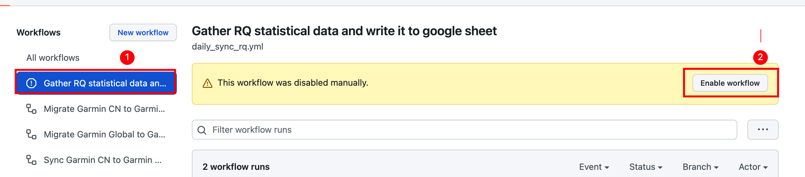

## 采集RQ数据：

[https://www.runningquotient.cn/](https://www.runningquotient.cn/) 是一个专业的跑步数据分析网站，提供的对跑者的"跑力"分析对我来说相当准确。
基本会员至多查詢42天內的跑力變化，更长时间（60，90，180）需要白金会员（RMB ¥60/月）才能看到， 故萌生了采集数据记录到表格自己统计到想法，配合Connect的详细统计数据，可以分析自己的跑步能力长期趋势。

## 采集的数据：

- RQ：
    - '跑力更新时间', '训练负荷', '疲劳', '即时跑力', '跑力', '跑力说明', '趋势1', '趋势2',
- Garmin Connect
    - '活动id', '活动名称', '活动开始时间', '距离', '持续时间', '速度 m/s', '配速 min/km', '配速文字 min/km', '平均心率', '最大心率', '平均每分钟步频', '有氧效果', '
      无氧效果', '触地时间', '步幅', 'VO2Max', '垂直振幅', '垂直振幅比', '触地平衡', '训练效果', '训练负荷'

分享我自己的跑步数据：
[点击打开表格查看](https://docs.google.com/spreadsheets/d/e/2PACX-1vRSk3aD6T3tFM-OA7Cl5BmFMJ7mdKriFgYvNQA6f5b8K6F_-CadaGa8TEjMmy-sIpOPfmdN1ktkhXxt/pubhtml?gid=0&single=true)

## 前置条件的前置条件

- **能畅通访问国际互联网**
- 有`Google`的`Gmail`邮箱账号
- 此脚本采集的是 `runningquotient.cn` 网站 与 **佳明中国区** 的数据，如果您使用的是 `runningquotient.com` 网站，则此脚本不适用。
- 如果您用的是国际区的佳明账号，可参考前文开启同步中国区功能，用中国区账号关联RQ，然后配合此脚本使用。

## 前置条件：

- runningquotient.cn 已关联运动手表的账号
- 佳明手表 （如果仅采集跑力数据，其他能关联到rq的手表都行，（华为/高驰/...，除佳明外我手头没有其他设备，无法验证））
- 二代跑步数据 (触地时间，步幅，垂直震幅，功率) 采集设备（Garmin RDP/HRM-PRO/HRM-RUN/...）
- Google Sheets（记录数据）/ Google Cloud Platform API (用于写入表格数据)

## ⚠️ 流程相对复杂，请参考视频教程来操作⚠️

文章只留下几个视频中用到网址供点击跳转

视频地址： 待添加

## Step1: 开启 Google Sheets API 并新建表格

相关网址:

- Google Sheets API: [https://console.developers.google.com/](https://console.developers.google.com/)
- Google Sheets: [https://docs.google.com/spreadsheets/](https://docs.google.com/spreadsheets/)
- 示例表格表头：[示例表格表头](https://docs.google.com/spreadsheets/d/1eX_6PcEn7kbtMTaBURS6DJvfmKFzaN6tqbw8qshvFYQ/edit?usp=sharing)

## Step2: 准备RQ网站相关信息：

RQ网站： [https://www.runningquotient.cn/](https://www.runningquotient.cn/)

## Step3: `github` 新增 `secrets`

谷歌表格ID: `GOOGLE_SHEET_ID`

谷歌API Email: `GOOGLE_API_CLIENT_EMAIL`

谷歌私钥：`GOOGLE_API_PRIVATE_KEY`

RQ 用户 ID：`RQ_USERID`

RQ 请求 COOKIE：`RQ_COOKIE`

RQ 请求 TOKEN：`RQ_CSRF_TOKEN`

**预留：**

和风天气 API KEY: `WEATHER_KEY`

## Step4: 开启采集功能

## Enjoy!

## 运行说明

此项采集跑步数据的功能运行频率为**每天22:30左右运行一次。**

采集RQ数据的原理是读取RQ首页的统计信息关键字，所以目前只能读取一条记录。

对于一天内有多条跑步记录的情况，只读取最后一条跑步记录的统计信息作为当天的记录数据。

有需求，有能力的跑友，欢迎提交 `PR` 

## Reference

- [How to Use Google Sheets As a Database For Your Business](https://blog.coupler.io/how-to-use-google-sheets-as-database/)
