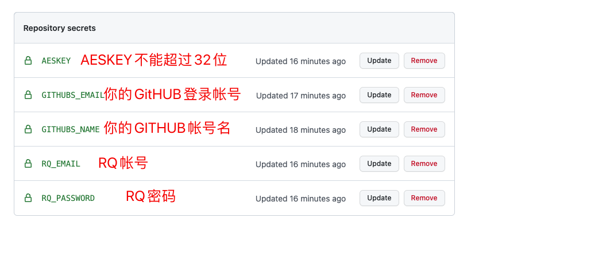
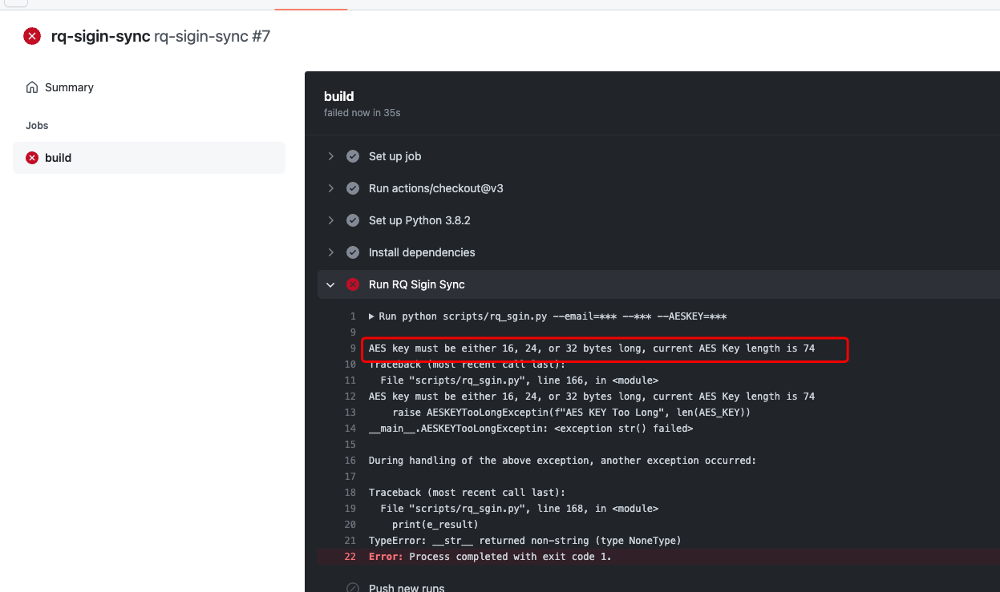
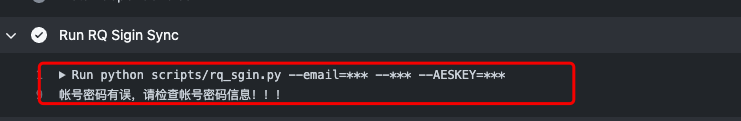

## RQ自动签到：


## Step1: `github` 新增 `secrets`

AESKEY: `AESKEY`  

​	AESKEY最多不能超过32位，推荐使用32位即使用AES-256加密算法，脚本中AESKEY的作用是加密保存RQ登录返回的user_id与access_token与再次执行脚本时解密数据，为什么要保存到sqlite中呢？因为防止每次执行脚本都要重新登录导致RQ发现是使用脚本执行出现封号情况，保存的数据会自动提交到github的仓库中不过不用担心数据泄露因为目前AES加密算法十分强大，理论上完全没办法破解只要你的AESKEY没泄露。

```	
知乎有关暴力解密AES-256回答
先放结论，资源有限，时间不足，用地球的每一粒沙子做出存储运算的话在太阳膨胀或者氦闪之前你都算不出来。下面是一些宇宙常数及计算（证明）过程。2^256就是256位AES的密钥空间的组合数，远大于地球中沙子的数量（3×10^23）。2^256>2^(10*25)>10^(3*25)=10^75>>>3×10^23现在问题来了。假设你能够把每一粒沙子做出一个存储设备，存一个值。你只能存储3*10^23个不同的答案。而你没法全部试一遍。（只考虑存储）。如果是1秒钟尝试20亿亿次（假定以天河4号专用为计算机）不同的组合。10^75/（20*10^8*10^8*86400*365）=10^58/86400/365/2>10^50年。这么长时间远远大于太阳的寿命，6*10^9亿年。
```

这里AESKEY 为 任意小于32位长度得字符串
eg. openssl rand -hex 16

GitHub 用户名: `GITHUBS_NAME`

GitHub 登录邮箱：`GITHUBS_EMAIL`

RQ 邮箱帐号：`RQ_EMAIL`

RQ 密码：`RQ_PASSWORD`



## 注意

#### 脚本执行异常处理

##### 1.AESKEY过长问题

解决方法: 输入小于32位的密钥



##### 2.帐号密码错误
解决方法: 输入正确密码与帐号



## 运行说明

此脚本运行频率为**每天00:30，01:30，07:30执行**有需要可以自行更改执行时间

## 运行出现问题联系方法
    1. 反馈问题给作者
    2. 微信群里提问或者Email: hwangxiaosi@gmail.com联系我
